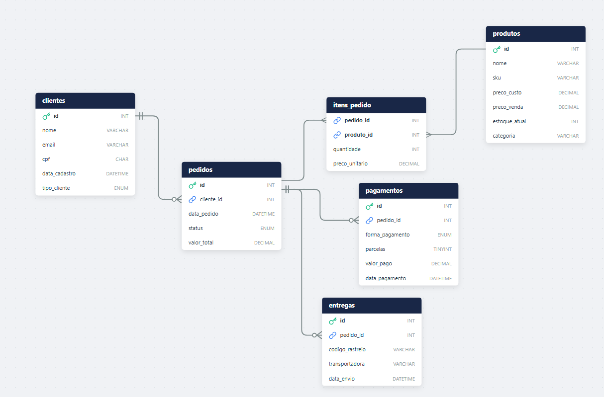

# Projeto banco de dados E-commerce
Projeto criado do zero com a finalidade de repassar conhecimentos adquiridos pela carreira de Analista de Suporte, hoje pratico
com foco de ser um desenvolvedor de Sistema, onde SQL é muito exigido pelo mercado.

## Diagrama Lógico

 - clientes (PK:id)
 - produtos (PK:id)
 - pedidos (PK:id, FK:cliente_id)
 - itens_pedido (PK Composta: pedido_id + produto_id, FK: ambos)
 - pagamentos (PK:id, FK:pedido_id) - One-to-One ou One-to-Many
 - entregas (PK: id, FK: pedido_id)

## Criando Banco de dados e tabelas
 - [script banco de dados e tabelas](./01-database-schema/01_deploy_ecommerce.sql)

## Populando dados com python com Faker
- Criar uma pasta 'popular_dados_com_python'
- Criar ambiente virtual  - No prompt: python -m venv venv
- ativar ambiente virtual - Acessar pasta: popular_dados_com_python\venv\Scripts   rodar: .\activate
- instalar dependecias: pip install faker mysql-connector-python pandas
### Link
- [popular_dados.py](./popular_dados_com_python/popular_dados.py)

## CHECKLIST DO DBA: EXPLAIN

Interpretação dos principais sinais do EXPLAIN e ações recomendadas:

| Sinal no EXPLAIN           | Interpretação                     | O que fazer                                      | Urgência |
|----------------------------|----------------------------------|--------------------------------------------------|----------|
| type = ALL                 | Full table scan                  | Criar índice na coluna do WHERE/JOIN             | 🔴 IMEDIATA |
| type = index               | Full index scan                  | Índice muito largo, revisar colunas              | 🟡 MÉDIA |
| type = range               | Busca por intervalo              | Bom, otimizar índice                             | 🟢 OK |
| type = ref                 | Busca por igualdade              | Índice eficiente                                 | 🟢 OK |
| type = const               | Acesso por PK única              | Perfeito                                         | 🟢 PERFEITO |
| Extra = Using temporary    | Uso de tabela temporária         | Otimizar GROUP BY / DISTINCT                     | 🔴 ALTA |
| Extra = Using filesort     | Ordenação externa                | Criar índice no ORDER BY                         | 🔴 ALTA |
| Extra = Using index        | Index covering                   | Perfeito, sem ação                               | 🟢 PERFEITO |
| Extra = Using where        | Filtro após índice               | Tentar cobrir com índice                         | 🟡 MÉDIA |
| Using join buffer          | JOIN sem índice                  | Criar índice nas colunas de JOIN                 | 🔴 ALTA |
| key_len alto               | Índice muito largo               | Remover colunas desnecessárias                   | 🟡 MÉDIA |
| key_len > 100              | Índice excessivamente grande     | Revisar índice composto                          | 🟡 MÉDIA |
| rows (estimado) > 10000    | Muitas linhas escaneadas         | Adicionar filtros mais restritivos               | 🟡 MÉDIA |
| rows (estimado) < 1000     | Boa seletividade                 | Ideal                                            | 🟢 OK |
| filtered = 100%            | Filtro eficiente                 | Ótimo                                            | 🟢 OK |
| filtered < 10%             | Filtro ineficiente               | Reordenar WHERE / melhorar índice                | 🟡 MÉDIA |
| Impossible WHERE           | Condição sempre falsa            | Corrigir lógica da query                         | 🔴 IMEDIATA |
| Select tables optimized away | Query otimizada pelo MySQL     | Nada a fazer                                     | 🟢 PERFEITO |
### Link
- [teste_explan_básico](./03-performance-tuning/diagnostico_lentidao.sql)

## Logs - Ambiente de Estudos

- Criar uma tabela específica para logs de consultas
- Criar um procedure para registrar consultas manuais
- teste de exemplo, configurando para varias consultas
### Link
- [Logs Ambiente de Estudo](./03-performance-tuning/02_teste_queries_com_logs.sql)

## Treinado Análises de Dados para Negócios
Para tomadas de decisões é preciso analisar os dados afim de responder perguntas relacionas ao negócio:
- Ranking de Vendas por Categoria mostrando: Mês, Categoria, Total Vendas, e Percentual de contribuição para aquele mês.
[solução](./02-business-queries/01_Ranking_vendas_por_categoria.sql)

- Análise de margem baseada em média ponderada
[solução](./02-business-queries/02_magem_media_ponderada.sql)
- Análise de margem por venda individual
[solução](./02-business-queries/03_margem_venda_individual.sql)
- Painel executivo Análise resumo para reunião de vendas do tipo alerta e recomendação
[solução](./02-business-queries/04_painel_executivo_reunioes_board.sql)

### Cancelamentos % - Análise de Fraude e Operação
- Análise de cancelamento por perfil
[solução](./02-business-queries/05_analise_de_canelamento_por_perfil.sql)
- Análise de cancelamento por perfil (Performance)
[solução](./02-business-queries/06_analise_de_cancelamento_com_performance.sql)