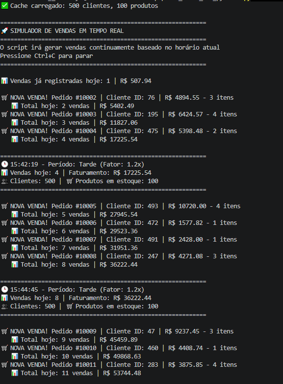

# Projeto banco de dados E-commerce

## Descrição
Projeto visando estudar, repassar e reutilizar conceitos que utilizei ao longo da minha carreira atuando como analista de suporte computacional para
uma empresa de varejo com forte vendas no ecommerce. Na época minha contratação foi focada na implementação de um infraestrutura robusta e suporte computacional para a empresa como um todo. Com o tempo houve a necessidade de expandir os conhecimentos para banco de dados e programação. Iniciei com a
iniciativa de introduzir a análise de dados para melhoria das tomadas de decisão, isso me fez mergulhar no banco de dados, buscando responder as perguntas 
que o negócio exigia para ser melhor direcionada. A linguagem SQL foi fundamental para que eu pudesse colocar em codigo todas essas questões, com ajuda de 
outra linguagem "python" pude expandir mais ainda os conhecimentos, agregar valores a um departamento que nascia na empresa "BI". 

## Foco nas Experiências passadas
- Preparo do servidor DB
- Analises de dados
- Performance de querys
- Api em python (django Rest) para disponibilidade de dados para parceiros terceiros como (salesForce) e sistemas de Dashboard de terceiros
- Projeto de criação de um RUB de dados para unificação de vendas de diversar fontes (lojas regionais) com (postgreSQL)
- Disponibilidade desses dados (indicadores) em tempo real com ferramentas streamlit em python
- Lidar com diversidade de SGBDs como: Postgresql, SqlServer (sap), Mysql(pdv lojas)

## Diagrama Lógico
Aqui busquei um modelo mais simples em comparação ao robusto sistema de dados do SAP onde realmente 'o filho chora a mãe não vê.'
Mas a proposta é a mesma, servindo de partida para idéia de sistemas de vendas, criação de APIs etc.

 - clientes (PK:id)
 - produtos (PK:id)
 - pedidos (PK:id, FK:cliente_id)
 - itens_pedido (PK Composta: pedido_id + produto_id, FK: ambos)
 - pagamentos (PK:id, FK:pedido_id) - One-to-One ou One-to-Many
 - entregas (PK: id, FK: pedido_id)
 - rastreamento_log(PK: id, FK: entragas_id)

## Ferramenta utilizada Mysql
O SGBD utilizado para estes estudos de casos foi o Mysql, para facil instalação, varios projetos para pequenas e médias empresa utilizam.
Nada como adapatar para outos SGBDs. Meu preferido é o Postgresql

## Criando Banco de dados e tabelas
 - [script banco de dados e tabelas](./01-database-schema/01_deploy_ecommerce.sql)

## Populando dados com python com Faker
- Criar uma pasta 'popular_dados_com_python'
- Criar ambiente virtual  - No prompt: python -m venv venv
- ativar ambiente virtual - Acessar pasta: popular_dados_com_python\venv\Scripts   rodar: .\activate
- instalar dependecias: pip install faker mysql-connector-python pandas
### Link
- [popular_dados.py](./popular_dados_com_python/popular_dados.py)

## Em tempo de desenvolvimento script python para limpar o banco
### Link
- [limpar_dados.py](./popular_dados_com_python/limpar_dados.py)

## CHECKLIST DO DBA: EXPLAIN (Desempenho com as queries)
O Foco não é ser um DBA aqui mas pensar como eles, tudo deve ser orientado a teste antes de aplicar um código
a ideia aqui é verificar como estão as consultas criadas e tentar melhorar-las.

Interpretação dos principais sinais do EXPLAIN e ações recomendadas:

| Sinal no EXPLAIN           | Interpretação                     | O que fazer                                      | Urgência |
|----------------------------|----------------------------------|--------------------------------------------------|----------|
| type = ALL                 | Full table scan                  | Criar índice na coluna do WHERE/JOIN             | 🔴 IMEDIATA |
| type = index               | Full index scan                  | Índice muito largo, revisar colunas              | 🟡 MÉDIA |
| type = range               | Busca por intervalo              | Bom, otimizar índice                             | 🟢 OK |
| type = ref                 | Busca por igualdade              | Índice eficiente                                 | 🟢 OK |
| type = const               | Acesso por PK única              | Perfeito                                         | 🟢 PERFEITO |
| Extra = Using temporary    | Uso de tabela temporária         | Otimizar GROUP BY / DISTINCT                     | 🔴 ALTA |
| Extra = Using filesort     | Ordenação externa                | Criar índice no ORDER BY                         | 🔴 ALTA |
| Extra = Using index        | Index covering                   | Perfeito, sem ação                               | 🟢 PERFEITO |
| Extra = Using where        | Filtro após índice               | Tentar cobrir com índice                         | 🟡 MÉDIA |
| Using join buffer          | JOIN sem índice                  | Criar índice nas colunas de JOIN                 | 🔴 ALTA |
| key_len alto               | Índice muito largo               | Remover colunas desnecessárias                   | 🟡 MÉDIA |
| key_len > 100              | Índice excessivamente grande     | Revisar índice composto                          | 🟡 MÉDIA |
| rows (estimado) > 10000    | Muitas linhas escaneadas         | Adicionar filtros mais restritivos               | 🟡 MÉDIA |
| rows (estimado) < 1000     | Boa seletividade                 | Ideal                                            | 🟢 OK |
| filtered = 100%            | Filtro eficiente                 | Ótimo                                            | 🟢 OK |
| filtered < 10%             | Filtro ineficiente               | Reordenar WHERE / melhorar índice                | 🟡 MÉDIA |
| Impossible WHERE           | Condição sempre falsa            | Corrigir lógica da query                         | 🔴 IMEDIATA |
| Select tables optimized away | Query otimizada pelo MySQL     | Nada a fazer                                     | 🟢 PERFEITO |
### Link
- [teste_explan_básico_exemplo](./03-performance-tuning/01_diagnostico_lentidao.sql)

## Logs - Ambiente de Estudos

- Criar uma tabela específica para logs de consultas
- Criar um procedure para registrar consultas manuais
- teste de exemplo, configurando para varias consultas
### Link
- [Logs Ambiente de Estudo](./03-performance-tuning/02_teste_queries_com_logs.sql)

## Glossário de Negócios para DBA (não é meu foco ser um mas pensar como um!!!)

GLOSSÁRIO DE NEGÓCIO PARA DBA JÚNIOR

| Termo | Significado | Query que responde |
|------|------------|-------------------|
| Churn | Clientes que pararam de comprar | Clientes sem compra > 90 dias |
| LTV | Quanto o cliente gasta em todo relacionamento | Soma total por cliente |
| CAC | Custo de Aquisição (precisa de tabela marketing) | marketing_cac (outra tabela) |
| ROI | Retorno sobre investimento | (Lucro - Investimento) / Investimento |
| NPS | Satisfação (precisa de pesquisa) | Média das notas de pesquisa |
| GMV | Volume bruto de mercadorias | SUM(valor_total) |
| AOV | Ticket médio | AVG(valor_total) |

## Treinando Análises de Dados para Negócios

## Perguntas organizadas por métricas de negócio (Glossário)

---

### GMV (Volume bruto de vendas)
Consultas focadas em volume total vendido.

- Relatórios de vendas  
[solucao](./02-business-queries/10_relatorio_vendas.sql)

- Relatório de vendas clientes Pleno  
[solucao](./02-business-queries/11_relatorio_vendas_cliente.sql)

- Ranking de Vendas por Categoria (mês, categoria, total e percentual)  
[solucao](./02-business-queries/01_Ranking_vendas_por_categoria.sql)

- Painel para Dashboard Executivo (Métrica Única). KPis em uma query para sistemas ou BI.
[solucao](./02-business-queries/14_painel_executic_kpi_bi.sql)

---

### LTV (Lifetime Value / Valor do cliente)
Foco em clientes que mais geram receita ao longo do tempo.

- Top 10 Clientes que mais compram  
[solucao](./02-business-queries/12_top_10_clientes_mais_compra.sql)

- Análise de Retenção de Clientes por Mês - Taxa de Cliente que voltam a comprar no mês seguinte
[solucao](./02-business-queries/17_analise_retencao_clientes_mensal.sql)

- LTV (Lifetime Value) por Cliente, análise individual da vida deste cliente (compras, gasto, alertas de relacionamento, dias de compras)
[solucao](./02-business-queries/18_LTV_lifetime_value_por_cliente.sql)

- Ranking detalhado de vendas (Top 10 + tendência + classificação para ação)  
[solucao](./02-business-queries/08_ranking_detalhado_vendas.sql)

- Analise abandono carrinho
[solucao](./02-business-queries/15_analise_abandono_carrinho.sql)

- Pares de produtos mais comprados juntos (Market Basket Analysis)
  - Identifica padrões de compra
  - Base para recomendação ("quem comprou X também comprou Y")
  - Aumenta LTV e Ticket Médio (AOV)
[solucao](./02-business-queries/16_analise_funil_vendas_cross_sell_e_up_sell.sql)

---

### AOV (Ticket Médio)
Mede o valor médio por pedido.

- Ticket Médio com análise de tendência  
[solucao](./02-business-queries/09_ticket_medio_com_analise_de_tendencia.sql)

---

### ROI (Retorno / Margem / Eficiência)
Análises financeiras e de rentabilidade.

- Análise de margem baseada em média ponderada  
[solucao](./02-business-queries/02_magem_media_ponderada.sql)

- Análise de margem por venda individual  
[solucao](./02-business-queries/03_margem_venda_individual.sql)

- Margem de contribuição por produto
  - Margem percentual
  - Lucro bruto total
  - Ranking de lucratividade
  - Volume de vendas como apoio
  
[solucao](./02-business-queries/24_margem_contribuicao.sql)

- Análise de performance de pagamentos
  - Total de transações por método
  - Valor total pago
  - Média de parcelas
  - Taxa de aprovação
  - Tempo médio até pagamento
  - Valor médio por parcela

[solucao](./02-business-queries/25_analise_pagamentos.sql.sql)

- Painel executivo (resumo com alertas e recomendações)  
[solucao](./02-business-queries/04_painel_executivo_reunioes_board.sql)

### Análise de Sucesso x Falhas

- Taxa de falha por método de pagamento
- Tempo médio de conversão (pedido → pagamento)
- Receita perdida por cancelamento
- Ticket médio perdido
- (OBS.)Como nosso cenário não a tabela não tem status de pagamento, usamos proxy via pedidos.status.

- VISÃO COMPLETA (nível executivo)
 - Pedido criado
   ↓
 - Forma de pagamento escolhida
   ↓
 - Tempo até pagamento
   ↓
 - Aprovado ou falha
   ↓

- Receita gerada ou perdida

[solucao](./02-business-queries/26.1_taxa_retencao_por_metodo_pagamento.sql)
- Taxa de falha por método (boleto vs cartão vs pix)

[solucao](./02-business-queries/26.2_taxa_conversao_por_metodo.sql)
- Tempo de conversão por método

[solucao](./02-business-queries/26.3_receita_perdida_por_falta_pagamento.sql)

`Implementei análises de performance de pagamentos incluindo taxa de falha por método, tempo de conversão e receita perdida, permitindo identificar gargalos no checkout e otimizar a conversão financeira.`

---

### Churn / Cancelamentos / Risco
Indicadores de perda de clientes ou problemas operacionais.

- Análise de cancelamento por produto
  - Taxa de cancelamento (%)
  - Volume de pedidos afetados
  - Ticket médio dos cancelamentos
  - Identificação de produtos problemáticos

[solucao](./02-business-queries/23_cancelamento_produto.sql)

- Análise de cancelamento por perfil  
[solucao](./02-business-queries/05_analise_de_canelamento_por_perfil.sql)

- Análise de cancelamento por perfil (performance)  
[solucao](./02-business-queries/06_analise_de_cancelamento_com_performance.sql)

---

### Operação / SLA / Lead Time
Performance logística e entrega.

- SLAs de Transportadoras (análise Simples)
[solucao](./02-business-queries/14_painel_executic_kpi_bi.sql)

- SLAs de Transportadoras (análise de entregas / lead time)  
[solucao](./02-business-queries/07_analise_de_performance_de_entregas.sql)

---

### Análises Avançadas / Data Science
Estudos mais profundos e técnicas estatísticas.

- Detecção de anomalias com Z-Score (identificação de outliers em vendas)  
[solucao](./02-business-queries/13_deteccao_de_anomalias-z-score.sql)

---

### Operação / Estoque / Data Science / Forecast / Planejamento(Giro e Ruptura)
Aqui questões críticas dos negócios são resolvidas ou melhoradas

VISÃO EMPRESA
- Curva ABC → Prioriza produtos importantes
        ↓
- Forecast → prevê demanda futura
        ↓
- Reposição → decide quanto comprar

#### Análises

- Análise de giro de estoque e cobertura
  - Total vendido por produto
  - Giro de estoque
  - Dias para zerar estoque
  - Alertas operacionais (excesso, ruptura, produtos sem venda)

[solucao](./02-business-queries/19_analise_giro_estoque_e_ruptura.sql)

- Curva ABC Real (80/20) baseada em faturamento (sem regras fixas - é percentual acumulado)
  - Detalhes da classificação:
  - Classe A (Alta Relevância): São os produtos mais importantes, representando cerca de 80% do faturamento, 
  mas em pequena quantidade de itens (aprox. 20%). Exigem controle rigoroso, inventários frequentes e 
  negociação próxima com fornecedores. 
  - Classe B (Relevância Média): Produtos intermediários, compondo cerca de 15% do faturamento e 30% dos itens. O controle é moderado, visando um equilíbrio entre estoque e custo. 
  - Classe C (Baixa Relevância): Itens com baixo faturamento (cerca de 5%), mas que representam a maior quantidade física de produtos (aprox. 50%). Exigem menos controle, evitando altos custos de armazenagem. 

[solucao](./02-business-queries/20_curva_ABC_real_80_20_baseada_faturamento.sql)

- Reposição automática (sugestão de compra)
  - Baseado no consumo médio

[solucao](./02-business-queries/21_reposicao_automatica.sql)

- Forecast simples (previsão de vendas)
  - versão prática (média móvel)

[solucao](./02-business-queries/22_forecast_vendas.sql)

`Implementei análises de Curva ABC baseada em faturamento, previsão de demanda e sugestão automatizada de reposição, integrando dados históricos de vendas para otimização de estoque e aumento de eficiência operacional.`

---

## Observação
Algumas análises (como cancelamentos e SLA) não aparecem diretamente no glossário clássico (LTV, CAC, etc.), mas são **indicadores operacionais críticos** que impactam diretamente métricas como:
- ROI
- Churn
- NPS

---

# Sistema de Recomendações (Querido do mercado) 
Aqui vamos ver e treinar algo que sempre é solicitado por sistema de ecommerce passo a passo, pois vamos tratar o banco alguns ajustes
como adicionar uma tabela para armazenar as remomedações (Deploy)

1. Deploy passo a passo
 - Criando indices, melhora a performance
 - Criando a tabela de recomendações
 - Gerando recomendações para a tabela criada
 - Consulta 'consumo' mas em SQL, em aplicações deve ser adaptada para consumo, ou até criação de views, depende da arquitetura pensada.
 - Consulta segmentando cliente Vip/Fiel
 - Automação utilizando EVENT do MySQL (atualizar a recomendacoes) - preferência, alguns times usando a propria aplicação ou cron do linux por exemplo.
 - Views - Padronização para consumo pronto e exemplo de consumo
 - Exemplo Simples mas prático de consumo.
 #### Link
 [solucao](./01-database-schema/02_deploy_sistema_remomendacoes.sql)

---

# Simulando dia-a-dia dos dados (Muito boa esta fase)
Aqui terá um script em python que irá popular as tabelas do projeto como se estivesse em produção,
para as análise seja mais proximas do dia a dia.

1. Modo Principal do Script (Vendas em tempo Real)
 - Gera vendas atuais
 - Baseado no horário real (mais vendas à tarde/noite)
 - Velocidade realista (Intervalos entre vendas de 20-300 segundos)
 - Para com Ctrl+C, mantendo os dados já inseridos
 - Comando: 
 `python simulador_vendas.py`
2. Modos específicos
 - `python simulador_vendas.py --backfill 30`       (popular dias atras, matendo o temporal)
 - `python simulador_vendas.py --data 2024-12-15`   (somente o dia específico)
3. Comportamentos
 - Madrugada (0-6h): 1 venda a cada ~5 minutos
 - Manhã (6-12h): 1 venda a cada ~45 segundos
 - Tarde (12-18h): 1 venda a cada ~30 segundos
 - Noite (18-24h): 1 venda a cada ~20 segundos
4. Evolução dos pedidos
 - Pedidos começam como Aguardando ou Pago
 - Com o passar das horas, status evoluem: Pago → Processando → Enviado → Entregue
 - Pagamentos podem levar de 0 a 30 minutos
5. Monitoramento em tempo real
 - Exibe status a cada 2 minutos
 - Mostra total de vendas e faturamento do dia
 - Top produtos e formas de pagamento

 #### Link
 [solucao](./popular_dados_com_python/simulador_vendas.py)

#### Resultado script rodando
 

 ---

# Passos que serão abordados
- api com java spring
- Painel dashboard

